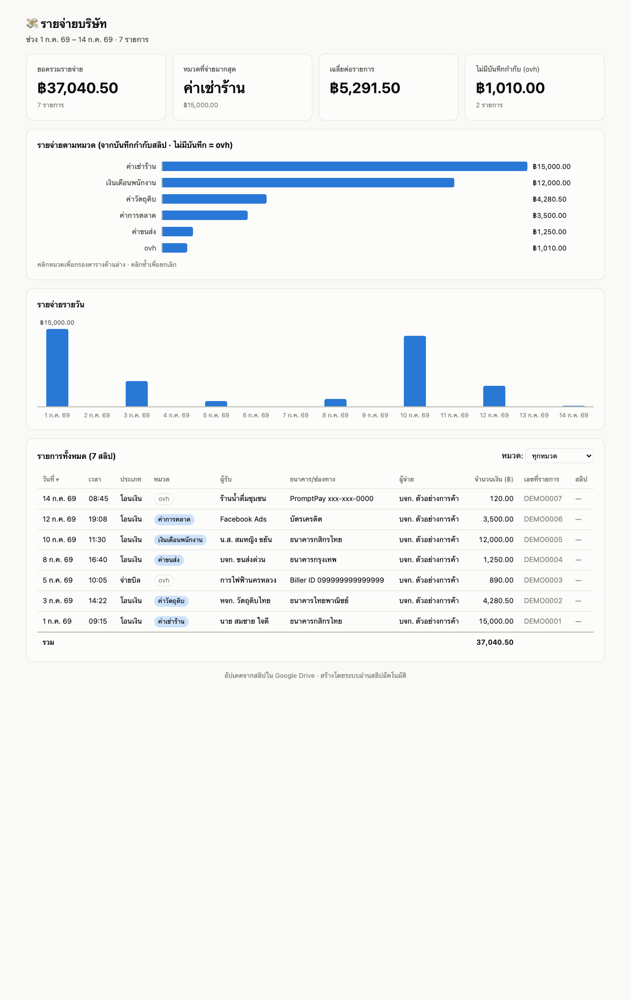

# 🧾 Slip Starter — ระบบบันทึกสลิปรายจ่ายอัตโนมัติด้วย AI

ถ่ายสลิปโอนเงินเข้า Google Drive → AI อ่านให้ทุกใบ → ได้ **Google Sheet + Dashboard** อัตโนมัติ
สำหรับเจ้าของธุรกิจที่ต้องเก็บสลิปรายจ่าย แต่ไม่อยากนั่งคีย์เอง

🌐 **ดูตัวอย่าง dashboard:** https://slip-starter-demo.vercel.app (ข้อมูลสมมติ)



## ทำอะไรได้

- 📥 ทีมถ่ายสลิปจากมือถือ → เข้าโฟลเดอร์ Drive (หรือผ่านหน้าเว็บ `/upload`)
- 🤖 Claude อ่านภาพสลิปเอง: วันที่ ยอดเงิน ผู้รับ ธนาคาร บันทึกช่วยจำ (แม่นเพราะอ่านเป็น "ภาพ" ไม่ใช่ OCR ธรรมดา)
- 🏷️ **บันทึกช่วยจำตอนโอน = หมวดรายจ่ายอัตโนมัติ** · ไม่เขียน = ลงหมวด `ovh` (ค่าโสหุ้ย)
- 📊 ได้ slips.csv + Google Sheet ใน Drive + เว็บ dashboard (กราฟหมวด/รายวัน, ตาราง sort-กรองได้, กดดูสลิปจริง)
- 🔁 โหมดอัตโนมัติ: มีสลิปใหม่ → ระบบอ่านเอง อัปเดตเว็บเองทุก 10 นาที

## สิ่งที่ต้องมี

- Mac ที่ติดตั้ง [Claude Code](https://claude.com/claude-code) แล้ว
- บัญชี Google (Drive) · บัญชี GitHub + [Vercel](https://vercel.com) ถ้าอยากได้ dashboard เป็นเว็บ

## เริ่มใช้ (ครั้งแรกครั้งเดียว)

```bash
git clone https://github.com/gobank01/slip-starter.git my-slips
cd my-slips
claude
```

แล้วพิมพ์ประโยคเดียว:

> **ติดตั้งระบบสลิป**

Claude จะพาทำทุกขั้นเอง: ติดตั้ง rclone, เชื่อม Google Drive, ใส่โฟลเดอร์สลิปของคุณ, ตั้ง GitHub/Vercel, เปิดโหมดอัตโนมัติ — ตอบคำถามไปทีละข้อพอ

## ใช้ประจำวัน

1. โอนเงินแล้ว**พิมพ์บันทึกช่วยจำทุกครั้ง** เช่น "ค่ากล่องพัสดุ" (นี่คือหมวดในรายงาน)
2. แคปสลิปเข้าโฟลเดอร์ Drive (หรือหน้า `/upload`)
3. จบ — ถ้าเปิดโหมดอัตโนมัติ dashboard อัปเดตเองใน ~10 นาที
   (โหมด manual: `./sync.sh` → เปิด Claude พิมพ์ `process new slips`)

## ความปลอดภัยข้อมูล

- ตั้ง GitHub repo ของคุณเป็น **private** (ข้อมูลการเงิน + สลิปจริง)
- dashboard บน Vercel เป็น URL สาธารณะ (ลิงก์เดายาก แต่ไม่มีรหัส) — แชร์เฉพาะคนที่ควรเห็น

## License

MIT — ใช้/แก้/แจกต่อได้อิสระ · สร้างโดย [BizDrive](https://bizdrive.app)
